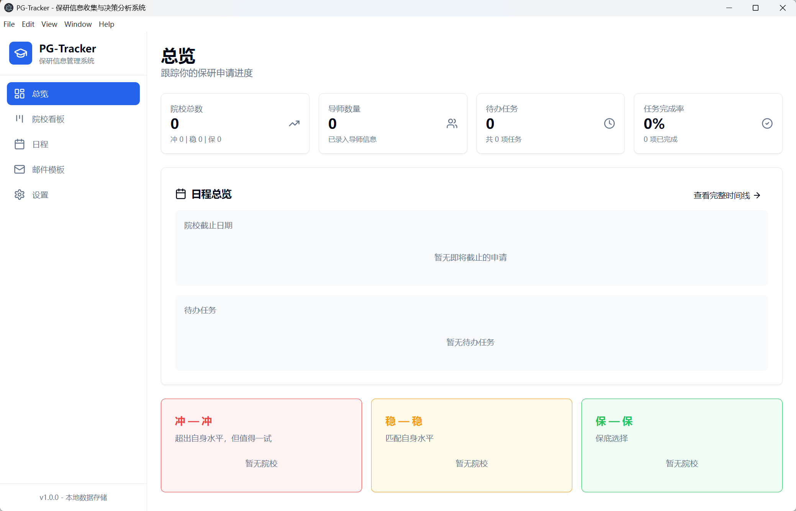
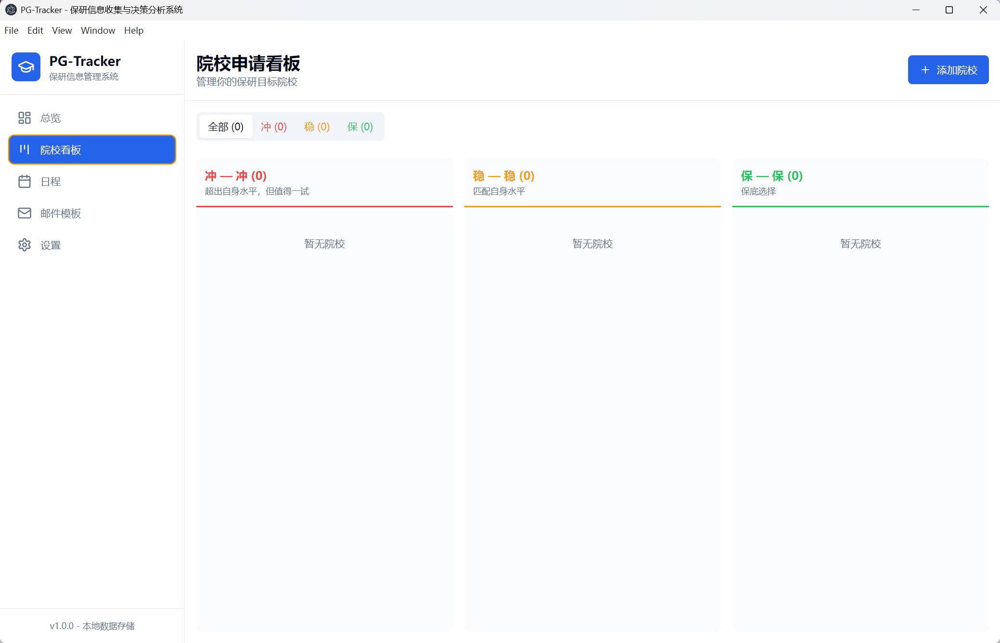
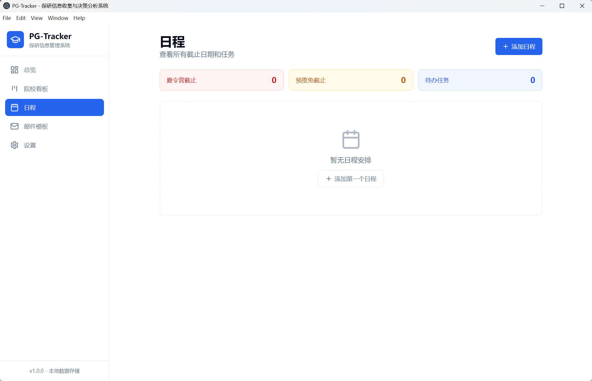
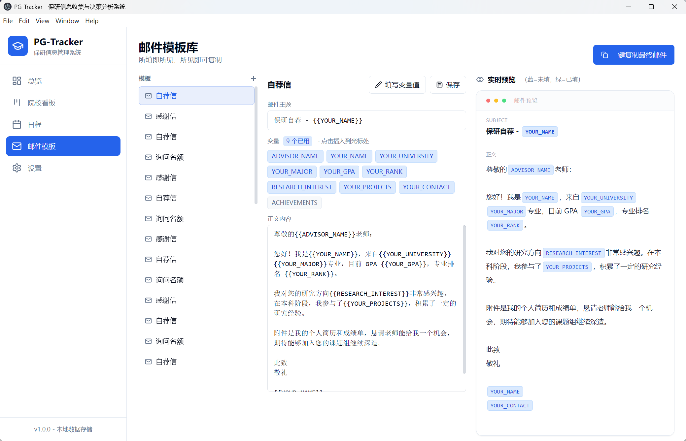
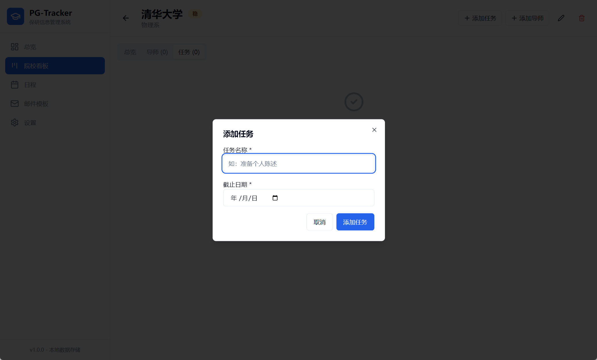
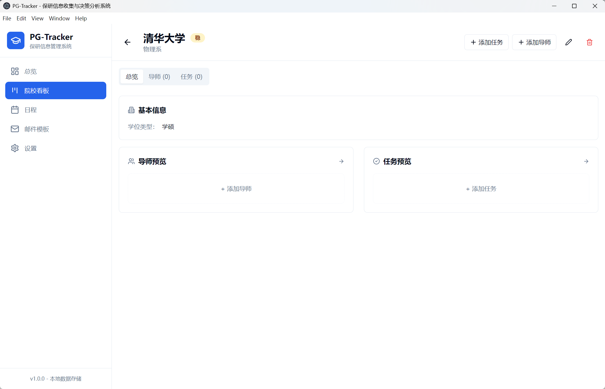
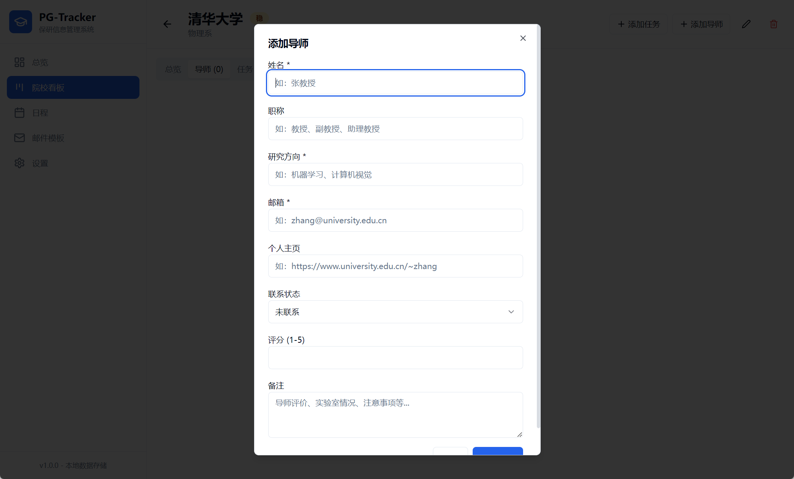
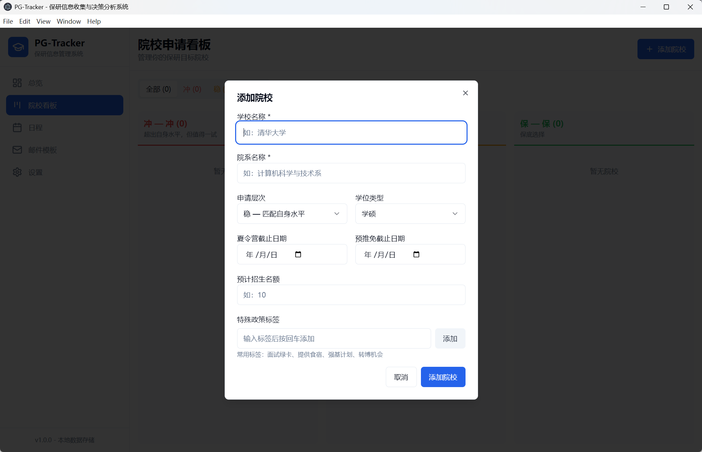
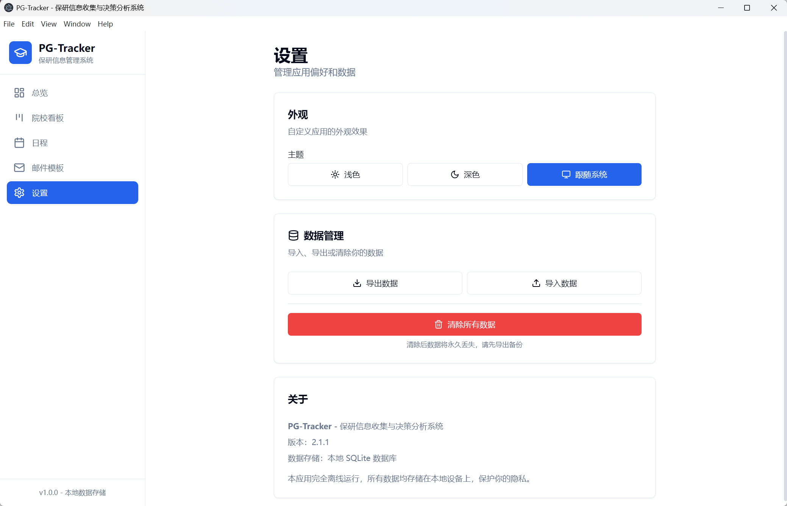

# PG-Tracker

保研信息收集与决策分析系统

一款专为中国大学生设计的跨平台保研申请管理桌面应用，支持 Windows、macOS、Linux 三大操作系统，帮助你系统化管理目标院校、导师信息、申请进度和面试记录，所有数据完全本地存储，保护隐私。


---

## 软件截图

| 总览仪表板 | 院校看板 |
|:--:|:--:|
|  |  |

> **总览仪表板**：顶部统计卡片（院校总数、导师数量、待办任务、任务完成率），院校截止日期按紧急程度颜色编码（≤7天红色、8-14天黄色），下方展示各等级分类下的目标院校。
>
> **院校看板**：冲/稳/保三列看板视图，每张卡片显示院校名称、院系、截止日期倒计时、导师数量，点击卡片进入详情页。

---

| 日程视图 | 邮件模板 |
|:--:|:--:|
|  |  |

> **日程视图**：统一展示所有夏令营截止、预推免截止和普通任务，按已过期/今天/明天/本周/即将到来分组。独立任务（无关联院校）可点击左侧圆圈即时完成切换，hover 显示编辑/删除按钮。
>
> **邮件模板**：左侧模板列表，右侧编辑区含变量标签（蓝色）实时渲染，下方预览区显示填充效果（绿色=已填、蓝色=未填），一键复制最终邮件内容。

---

| 添加任务 | 添加导师 |
|:--:|:--:|
|  |  |

> **添加任务**：为指定院校创建待办事项，填写任务标题、截止日期，关联院校后可从详情页统一管理。
>
> **添加导师**：在院校详情页添加目标导师，填写姓名、职称、研究方向、邮箱、个人主页，设置初始联系状态（未联系/已发送/已回复等）。

---

| 导师详情 | 院校详情 |
|:--:|:--:|
|  |  |

> **导师详情卡**：追踪联系状态流转（未联系→已发送→已回复→面试中→已拒绝/已接受），声誉评分（1-5星），备注信息，关联文件（简历、成绩单、推荐信），面经记录入口。
>
> **院校详情**：基本信息面板含学位类型、招生名额、夏令营/预推免截止日期；导师预览和任务预览双列布局，支持快捷新建导师或任务。

---

| 设置页面 |
|:--:|
|  |

> **设置**：主题切换（浅色/深色/跟随系统），数据导出 JSON 备份，数据导入恢复，数据清空（双重确认防误删），联系我们卡片（客服微信）。

---

## 下载与安装

> ⚠️ 所有平台的安装包均在 [Releases](https://github.com/Jensenyjc/PG-tracker/releases) 页面下载，认准对应平台的文件名即可。

---

### 🪟 Windows

#### 下载

1. 打开 [Releases](https://github.com/Jensenyjc/PG-tracker/releases) 页面
2. 在最新版本（v2.2.0）的 Assets 中，找到 **`PG-Tracker-2.2.0-win-setup.exe`**
3. 点击下载

#### 安装与运行

1. 下载完成后，**首次安装请勿直接双击** `.exe` 文件，而是右键点击该文件，选择 **"以管理员身份运行"** 来启动安装向导
2. 跟随安装向导提示完成安装（可自定义安装路径）
3. 安装完成后，在开始菜单或桌面找到 **PG-Tracker**，双击运行即可（后续运行无需管理员权限）
4. 首次启动会自动初始化本地数据库，无需额外配置

#### 注意事项

- 如果 Windows 提示"SmartScreen 筛选器已阻止启动"，点击"更多信息"→"仍要运行"即可，这是未签名软件的正常提示
- 数据默认保存在 `%APPDATA%\PG-Tracker\dev.db`，可前往"设置"页面导出 JSON 备份

---

### 🍎 macOS

#### 下载

1. 打开 [Releases](https://github.com/Jensenyjc/PG-tracker/releases) 页面
2. 在最新版本（v2.2.0）的 Assets 中，找到以下任意文件：
   - **`PG-Tracker-2.2.0-mac-x64.dmg`** — 推荐，图形化安装界面
   - **`PG-Tracker-2.2.0-mac-x64.zip`** — 便携版，无需安装

#### 安装步骤

**方式一：通过 DMG 安装（推荐）**

1. 双击下载的 `.dmg` 文件，挂载磁盘镜像
2. 将镜像中的 **PG-Tracker.app** 拖入左侧的"应用程序"文件夹
3. 等待复制完成后，弹出 DMG

**方式二：通过 ZIP 解压运行**

1. 双击 `.zip` 文件自动解压
2. 进入解压后的文件夹，将 **PG-Tracker.app** 拖入"应用程序"文件夹

#### ⚠️ 重要：绕过 macOS 安全拦截

macOS 默认只允许运行来自 App Store 的已签名应用，首次打开未签名应用会弹出提示，按以下步骤解决：

**方法 1：右键打开（推荐）**

1. 在"应用程序"文件夹中找到 PG-Tracker
2. **不要双击**，在图标上**右键单击**
3. 选择弹出菜单中的**"打开"**
4. 系统会弹出第二次确认对话框，点击**"打开"**即可

**方法 2：终端解除隔离属性（若方法 1 无效）**

1. 打开 Mac 自带的**终端（Terminal）**
2. 复制并运行以下命令（复制整行后回车）：
   ```bash
   sudo xattr -rd com.apple.quarantine /Applications/PG-Tracker.app
   ```
3. 输入电脑开机密码（输入时屏幕不显示字符，正常现象），回车确认
4. 完成后即可正常双击运行

#### 注意事项

- 本软件为开源免签名版本，**不是病毒**，可放心运行
- 数据保存在 `~/Library/Application Support/PG-Tracker/`

详细说明：[INSTALL_MAC.md](INSTALL_MAC.md)

---

### 🐧 Linux

#### 下载

1. 打开 [Releases](https://github.com/Jensenyjc/PG-tracker/releases) 页面
2. 在最新版本（v2.2.0）的 Assets 中，找到以下任意文件：
   - **`PG-Tracker-2.2.0-linux-x64.AppImage`** — 推荐，便携免安装
   - **`PG-Tracker-2.2.0-linux-x64.deb`** — Debian/Ubuntu 系专用安装包

#### 安装步骤

**方式一：AppImage（推荐，支持所有主流发行版）**

1. 下载 `.AppImage` 文件到任意目录（如 `~/Downloads/`）
2. 赋予执行权限（二选一）：

   **图形化方式：**
   - 在文件管理器中找到该文件 → 右键 → 属性 → 权限 → 勾选**"允许作为程序执行"** → 确定

   **终端方式：**
   ```bash
   cd ~/Downloads
   chmod +x PG-Tracker-2.2.0-linux-x64.AppImage
   ```

3. 双击文件即可运行，**无需安装**

**方式二：.deb 安装包（仅限 Ubuntu / Debian / Linux Mint 等）**

1. 双击下载的 `.deb` 文件，系统会调用"Ubuntu 软件"（GDebi）打开
2. 点击"安装"，输入密码，等待安装完成
3. 若遇到依赖问题，在终端运行以下命令修复：
   ```bash
   sudo dpkg -i ~/Downloads/PG-Tracker-2.2.0-linux-x64.deb
   sudo apt-get install -f
   ```

#### 注意事项

- AppImage 需要图形环境，请在桌面环境下运行
- 部分发行版可能缺少 GTK 依赖，如提示缺失库，请通过系统包管理器安装：
  ```bash
  # Ubuntu/Debian
  sudo apt install libgtk-3-0
  # Fedora
  sudo dnf install gtk3
  ```
- 数据保存在 `~/.config/PG-Tracker/`

详细说明：[INSTALL_LINUX.md](INSTALL_LINUX.md)

---

## 快速开始

1. **添加院校** — 点击看板页的 "+" 按钮（如图），填写院校名称、院系、等级（冲/稳/保）、截止日期等信息
2. **添加导师** — 进入院校详情页，在"导师"选项卡中添加目标导师的联系方式和研究方向
3. **追踪进度** — 随时更新导师联系状态（未联系 → 已发送 → 已回复 → 面试中 → 已接受/已拒绝）
4. **管理日程** — 在"日程"页面统一查看所有截止日期和待办任务，支持创建独立于院校的任务
5. **记录面经** — 面试结束后，在导师卡片上点击"记录面经"，用 Markdown 记录面试内容
6. **发送邮件** — 在"邮件模板"页面选择模板，填入变量，一键复制后粘贴到邮箱
7. **备份数据** — 在"设置"页面随时导出 JSON 备份，换电脑时可导入恢复

---

## 软件概述

PG-Tracker 围绕保研申请的完整生命周期设计，将院校筛选、导师联系、材料管理、日程追踪等环节整合在一个工具中。核心理念是**以院校为中心、以看板为视角、以时间线为驱动**，让保研准备过程井然有序。

### 整体工作流

```
添加目标院校（按冲/稳/保分类）
    ├── 录入导师信息 → 追踪联系状态 → 记录面经
    ├── 创建待办任务（可关联院校，也可独立存在）→ 按截止日期排序
    ├── 绑定申请材料 → 简历、成绩单、推荐信
    └── 使用邮件模板 → 一键生成自荐信/询问信/感谢信
```

---

## 功能详解

### 1. 总览仪表板

应用首页提供保研全局概览：

- **统计面板**：院校总数、导师数量、待办任务数、任务完成率，均按冲/稳/保分类统计
- **截止日期预警**：展示所有未过期的夏令营/预推免截止日期，按紧急程度颜色编码（红色 ≤ 7 天、黄色 7-14 天）
- **待办任务**：同时展示院校关联任务和独立任务，独立任务显示"无关联院校"，点击不跳转
- **三分类速览**：冲/稳/保各列最多展示 5 所院校，快速掌握申请分布，超出自动出现滚动条

点击任意院校可直接跳转到院校详情页。

### 2. 院校看板（Kanban）

以看板视图管理所有目标院校，三列分别对应：

| 列 | 含义 | 颜色 |
|----|------|------|
| 冲（REACH） | 超出自身水平但值得一试的院校 | 红色 |
| 稳（MATCH） | 与自身水平匹配的院校 | 黄色 |
| 保（SAFETY） | 保底选择 | 绿色 |

每张院校卡片展示：院校名称、院系、学位类型（学硕/直博）、招生名额、特殊政策标签、截止日期倒计时、导师数量。支持按等级标签筛选（全部/冲/稳/保）。

### 3. 院校详情页

点击院校卡片进入详情页，包含三个选项卡：

**总览**
- 基本信息：学位类型、招生名额、夏令营截止日期、预推免截止日期
- 特殊政策标签展示
- 导师快速预览 / 任务快速预览，左右双列布局

**导师**
- 完整的导师信息卡片列表，每位导师展示：
  - 姓名、职称、研究方向
  - 邮箱（可点击发送）、个人主页链接
  - 联系状态下拉切换：未联系 → 已发送 → 已回复 → 面试中 → 已拒绝 / 已接受，各状态独立颜色
  - 声誉评分（1-5 分）
  - 备注（导师评价、实验室情况、避雷信息等）
  - 关联文件（简历、成绩单、推荐信等）
  - 面经记录入口
- 冲突检测：同一院系多位导师同时处于"已发送"状态时会弹出警告

**任务**
- 为该院校创建的待办事项列表
- 每条任务可标记完成/未完成，支持编辑和删除
- 按截止日期排序

### 4. 日程视图（Timeline）

将所有院校的截止日期和任务统一汇总为时间线，按时间段分组：

- 已过期（红色警告）
- 今天
- 明天
- 本周
- 即将到来

**事件类型**包括：
- 🏫 夏令营截止
- 📋 预推免截止
- ✅ 普通任务（可关联院校，也可独立存在）

**独立任务**（无关联院校）特有交互：
- 点击左侧圆圈 → 即时切换完成状态（乐观更新，无需等待数据库）
- Hover 显示编辑 / 删除按钮
- 编辑弹窗修改标题和截止日期

已完成的任务会以删除线和透明效果显示。

### 5. 邮件模板编辑器

内置邮件模板编辑器，支持在界面增删改查：

| 模板 | 用途 |
|------|------|
| 自荐信 | 首次联系导师，介绍个人背景和科研经历 |
| 询问名额 | 简洁地询问导师是否有招生名额 |
| 感谢信 | 面试后向导师表达感谢 |

支持变量占位符（如 `{{ADVISOR_NAME}}`、`{{YOUR_NAME}}`、`{{RESEARCH_AREA}}` 等），点击变量按钮快速插入，`{{变量名}}` 在编辑区实时渲染为彩色标签。右侧预览区实时显示填充效果（绿色=已填，蓝色=未填）。一键复制最终邮件内容到剪贴板。

### 6. 面经记录

为每位导师记录面试经历，表单包含：

- 面试日期、面试形式（线上/线下）
- Markdown 格式的面经内容，预填充结构化模板：
  - 面试问题记录
  - 专业问题
  - 算法题（含代码块）
  - 英语问答
  - 总结与反思

### 7. 文件管理

为导师绑定本地文件，支持的文件类型分类：

- 简历（RESUME）
- 成绩单（TRANSCRIPT）
- 推荐信（RECOMMENDATION）
- 其他文件

通过系统文件选择器绑定本地路径，可一键调用系统默认程序打开。同时支持 LaTeX 编译功能（调用本地 `xelatex`）。

### 8. 设置

- **主题切换**：浅色 / 深色 / 跟随系统
- **数据导出**：将所有数据导出为 JSON 文件备份（命名格式：`pg-tracker-backup-YYYY-MM-DD.json`）
- **数据导入**：从 JSON 备份文件恢复数据（完整恢复院校、导师、任务、邮件模板等所有数据）
- **数据清除**：清空所有本地数据（双重确认防误删）
- **联系我们**：客服微信展示，有问题或建议欢迎联系

---

## 数据模型

```
Institution（院校）
├── name          院校名称
├── department    院系
├── tier          等级（REACH / MATCH / SAFETY）
├── degreeType    学位类型（MASTER / PHD）
├── campDeadline  夏令营截止日期
├── pushDeadline  预推免截止日期
├── expectedQuota 预计招生名额
├── policyTags    特殊政策标签
├── advisors[]    导师列表
│   ├── name / title / researchArea / email / homepage
│   ├── contactStatus   联系状态（6 种状态流转）
│   ├── reputationScore 评分（1-5）
│   ├── notes           备注
│   ├── assets[]        关联文件
│   └── interviews[]    面经记录
└── tasks[]       关联任务（institutionId 非空）
    ├── title     任务标题
    ├── dueDate   截止日期
    └── isCompleted 完成状态

Task（独立任务，institutionId 为 null）
├── title         任务标题
├── dueDate       截止日期
└── isCompleted   完成状态
```

所有数据存储在本地 SQLite 数据库中，不联网、不上传，完全保护隐私。

---

## 技术栈

| 类别 | 技术 |
|------|------|
| 桌面框架 | Electron 33.4 |
| 前端 | React 18.3 + TypeScript |
| 构建工具 | electron-vite + Vite 5 |
| 打包 | electron-builder（Windows / macOS / Linux） |
| UI 组件 | shadcn/ui (Radix UI + Tailwind CSS) |
| 数据库 | SQLite + Prisma ORM 5.x |
| 状态管理 | Zustand |
| 日期处理 | date-fns |

---

## 项目结构

```
pg-tracker-v2/
├── electron/
│   ├── main/index.ts          # 主进程：数据库操作、文件操作、IPC 处理
│   └── preload/index.ts        # 预加载脚本：安全的 IPC 桥接层
├── prisma/
│   ├── schema.prisma           # 数据库模型定义（支持 Win/Mac/Linux 多引擎）
│   └── dev.db                  # SQLite 数据库文件
├── src/
│   ├── App.tsx                 # 应用主入口，视图路由
│   ├── components/
│   │   ├── features/
│   │   │   ├── Dashboard.tsx        # 总览仪表板
│   │   │   ├── KanbanBoard.tsx      # 院校看板
│   │   │   ├── InstitutionCard.tsx   # 院校卡片
│   │   │   ├── InstitutionDetail.tsx # 院校详情页
│   │   │   ├── InstitutionForm.tsx   # 院校表单
│   │   │   ├── AdvisorForm.tsx       # 导师表单
│   │   │   ├── InterviewForm.tsx     # 面经记录表单
│   │   │   ├── TaskForm.tsx          # 任务表单
│   │   │   ├── Timeline.tsx          # 日程时间线（含独立任务）
│   │   │   ├── EmailTemplates.tsx    # 邮件模板编辑器
│   │   │   └── Settings.tsx          # 设置页面
│   │   ├── layout/
│   │   │   └── Sidebar.tsx           # 左侧导航栏
│   │   └── ui/                       # 基础 UI 组件（Dialog / Select / Tabs 等）
│   ├── stores/
│   │   └── appStore.ts               # Zustand 全局状态管理
│   └── lib/
│       └── utils.ts                   # 工具函数
├── docs/images/                # 软件截图
│   ├── 总览页面.png / 院校看板.png / 日程界面.png
│   ├── 邮件模板页面.png / 添加任务详细页面.png
│   ├── 添加导师与任务页面.png / 添加导师详细页面.png
│   ├── 添加院校页面.png / 设置页面.png
├── electron-builder-mac.yml    # macOS 独立打包配置（dmg + zip）
├── electron-builder-linux.yml  # Linux 独立打包配置（AppImage + deb）
├── INSTALL_MAC.md              # macOS 安装指南
├── INSTALL_LINUX.md            # Linux 安装指南
├── electron.vite.config.ts      # electron-vite 构建配置
└── package.json
```

---

## License

MIT
